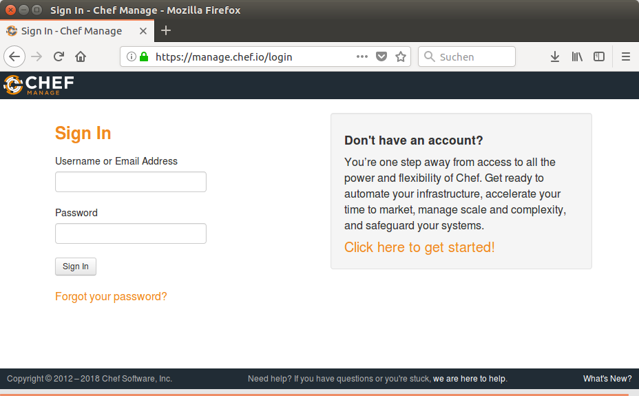

# Vorraussetzungen
Sofern Sie eine neue Umgebung von Beginn an aufsetzen wollen, folgen Sie den Vorraussetzungen bitte Schritt für Schritt. 

# Software

Zur Abarbeitung des kompletten Buchs, benötigen Sie folgende Software:
	
* einen Browser und Internetzugang
* VMware workstation / VirtualBox o.ä 
* [Ubuntu 16.04 iso](https://www.ubuntu.com/download/desktop)

# Registrierung
Sie benötigen ein Account auf https://manage.chef.io um ihre Organisationen und aktiven Clients zu verwalten. Registrieren Sie sich bitte mit einem Klick auf "Click here to get started!"

