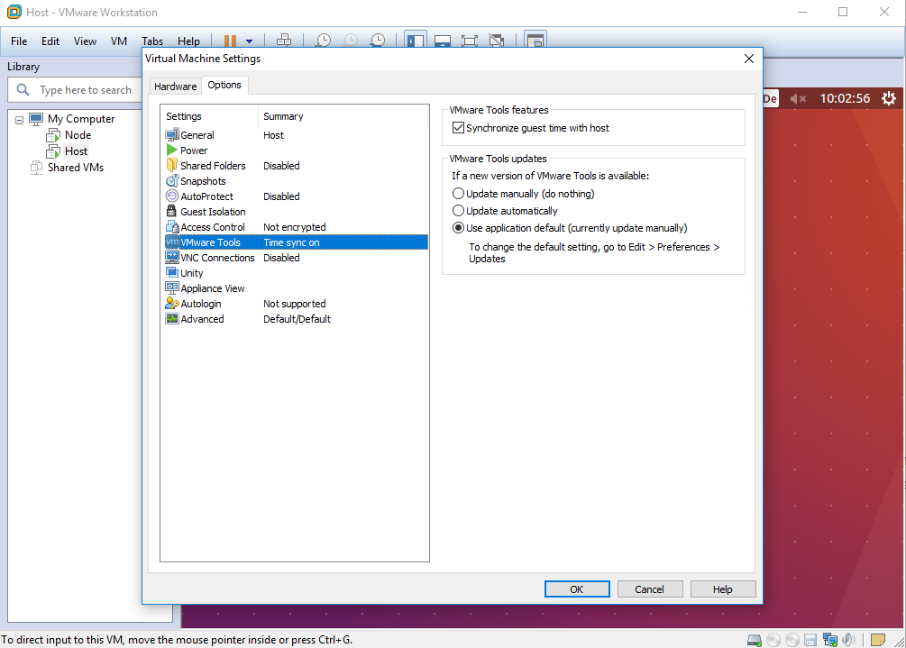

# Client Vorbereitung
[Video Tutorial](https://www.youtube.com/watch?v=e5ms8EQ89VU)  
Als gegeben wird eine Ubuntu VM 16.04, befindlich in: 

> E:\VM\LV-Reichelt\IMAGES\Ubuntu16.04

und eine Umgebung zum Einrichten/Starten der virtuellen Maschine vorausgesetzt.
(z.B.: VM Workstation 12 Pro)

Für das Beispiel in VM Workstation 12 Pro öffnen sie die VM und vergeben sie einen Namen (z.B.: ClientVM) und wählen Sie einen Pfad als Ablageort aus.

## VM starten
Starten sie die VM und loggen Sie sich in den Studentenaccount ein.
  
## OpenSSH - Server installieren

Zur Konfiguration der Clients wird eine SSH - Verbindung benötigt. Laden Sie sich dazu das Programm **openssh-server** herunter.
Loggen Sie sich dazu in die VM ein (user: student, passwort: itsm) und geben Sie folgenden Befehl in ein geöffnetes Terminal ein: 

> sudo apt-get install openssh-server --yes

**Mögliche Fehler:**

Falls sie folgende Fehlermeldung erhalten: 

Geben Sie folgende Befehle ein:
> sudo rm /var/lib/dpkg/lock  
> sudo dpkg --configure -a

Besteht das Problem weiterhin, starten sie die VM neu.

Anschließend sollte die Installation reibungslos verlaufen.

## Systemuhr synchronisieren

Um spätere Fehler zu vermeiden, müssen Sie die Systemuhr der VM auf die des Hostsystems snchronisieren. In VM Workstation 12 Pro geht dies wie folgt:

* Rechtsklick auf die VM im linken Anzeigefeld.  
* Tab Optionen -> VMware Tools
* Haken bei *synchronize guest time with host* setzen  

  

