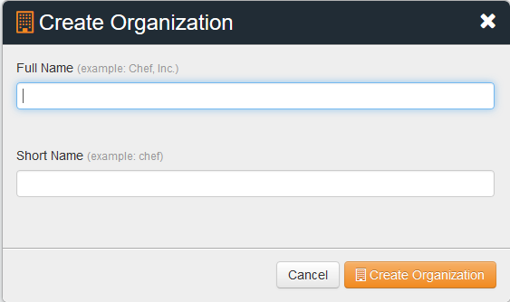
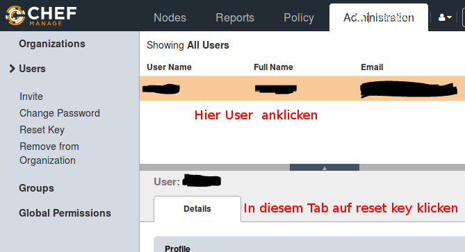
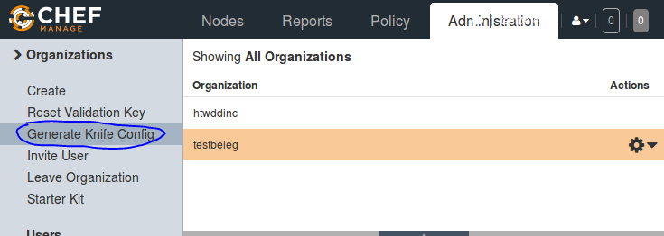
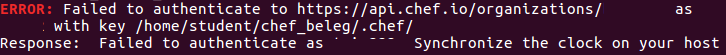

# Deployment des Kochbuchs 
Das Ausrollen des Kochbuchs erfolgt über die ServerVM, welche sie unter [Vorbereitung des Clients](./ServerVorbereitung.md) eingerichtet haben.

## Klonen des Chef Kochbuchs

Öffnen sie in einer geöffneten ServerVM einen Terminal und geben Sie folgenden Befehl ein:

> git clone https://github.com/Erlix322/chef_beleg

Wechseln Sie in das Verzeichnis: 

> cd chef_beleg/cookbooks/beleg

## Registrierung
Sie benötigen ein Account auf https://manage.chef.io um ihre Organisationen und aktiven Clients zu verwalten. Registrieren Sie sich bitte mit einem Klick auf "Click here to get started!"

## Organisation erstellen
Erstellen Sie anschließend eine Organisation, z.B.: HTWOrganisation

## User Zertifikat erstellen

Loggen Sie sich auf manage.chef.io in Ihrer erstellten Organisation ein.
Im Tab **Administration** klicken sie auf **Users** und wählen Sie den ersten Eintrag aus.

Klicken Sie anschließend auf **Reset Key** in den User Details und laden Sie sich die .pem Datei herunter.

**Anmerkung** In einem Produktivsystem, würden Sie die Keys zentral verwalten und nicht einfach resetten und einen neuen Erstellen. 

Kopieren Sie die heruntergeladene Datei mit folgenden Befehlen: 

> cd ~  
> cp Downloads/<your_file>.pem ./chef_beleg/.chef/

## Knife Konfiguration erstellen
Klicken Sie auf den Tab *Administration*, klicken Sie links auf *Organization* und auf "Knife Konfiguration erstellen". Speichern sie die Datei in Downloads.

> cd ~
> cp Downloads/<your_knife_file>.pem ./chef_beleg/.chef/

## Upload der Rezepte
Geben Sie folgende Befehle ein

> cd ~/chef_beleg/cookbooks/beleg  
> berks update  
> berks install  
> berks upload --force  

## Ausrollen des Kochbuchs

Geben Sie die folgenden Befehle in das Teminal ein:

> cd ~/chef_beleg/cookbooks/beleg/  

> knife bootstrap 192.168.144.135 --ssh-user student --ssh-password 'itsm' --sudo --use-sudo-password 'itsm' --node-name server_gruppe_n --run-list 'recipe[beleg]' --yes

**ACHTUNG:**Ersetzen Sie dabei die IP durch die IP der ClientVM!

**Mögliche Fehlerquellen**
Falls Sie folgenden Fehler erhalten: 

Befolgen Sie die folgenden Anweisungen unter: [Systemuhr synchronisieren](./ServerVorbereitung.md)
