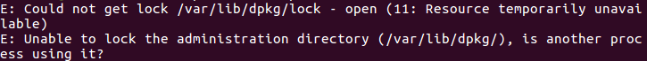

# Server Vorbereitung
Als gegeben wird eine Ubuntu VM 16.04, befindlich in: 

> E:\VM\LV-Reichelt\IMAGES\Ubuntu16.04

und eine Umgebung zum Einrichten/Starten der virtuellen Maschine vorausgesetzt.
(z.B.: VM Workstation 12 Pro)

Für das Beispiel in VM Workstation 12 Pro öffen sie die VM und vergeben sie einen Namen (z.B.: ServerVM) und wählen Sie einen Pfad als Ablageort aus.

## Chef DK installieren

Laden Sie sich das Chef Development Kit herunter! Öffnen Sie dazu ein Terminal und geben folgenden Befehl ein:

> wget https://packages.chef.io/files/stable/chefdk/2.4.17/ubuntu/16.04/chefdk_2.4.17-1_amd64.deb

Installieren Sie es anschließend über den Befehl:

> sudo dpkg -i chefdk_2.4.17-1_amd64.deb

**Mögliche Fehler:**

Falls sie folgende Fehlermeldung erhalten: 

Geben Sie folgenden Befehl ein:
> sudo pgrep -f 'dpgk|apt' | xargs kill

## Git installieren

Die Versionierung der Chef Kochbücher erfolgte in Git. Dazu installieren sie sich bitte folgendes Program bei geöfnetem Terminal:

> sudo apt-get install git

**Mögliche Fehler:**

Falls sie folgende Fehlermeldung erhalten: 

Geben Sie folgenden Befehl ein:

> sudo pgrep -f 'dpgk|apt' | xargs kill

Anschließend sollte die Installation reibungslos verlaufen.

